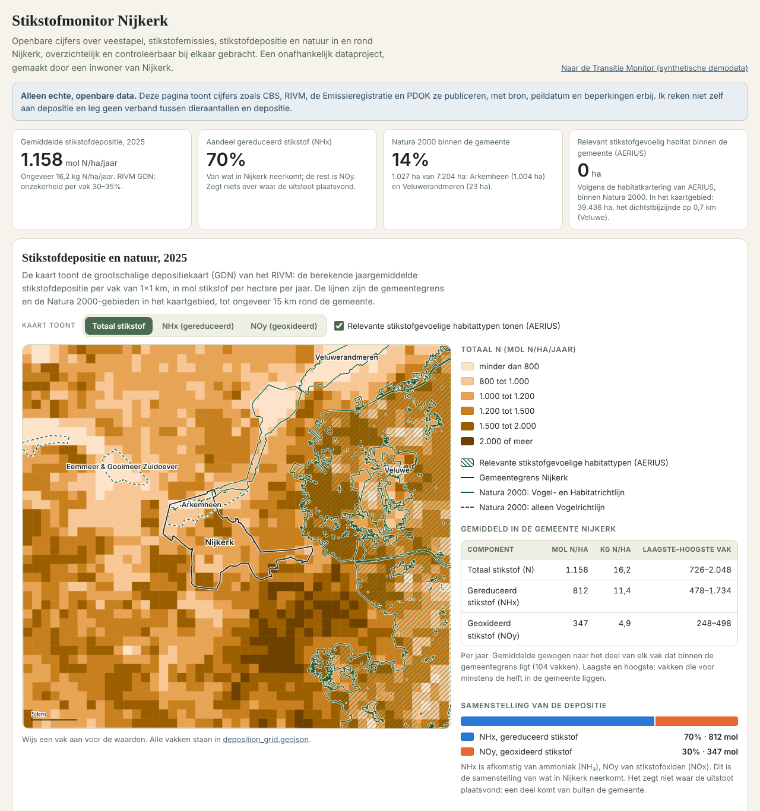
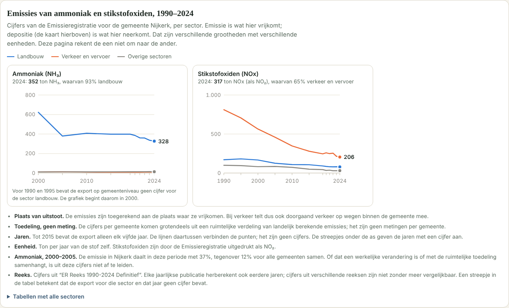
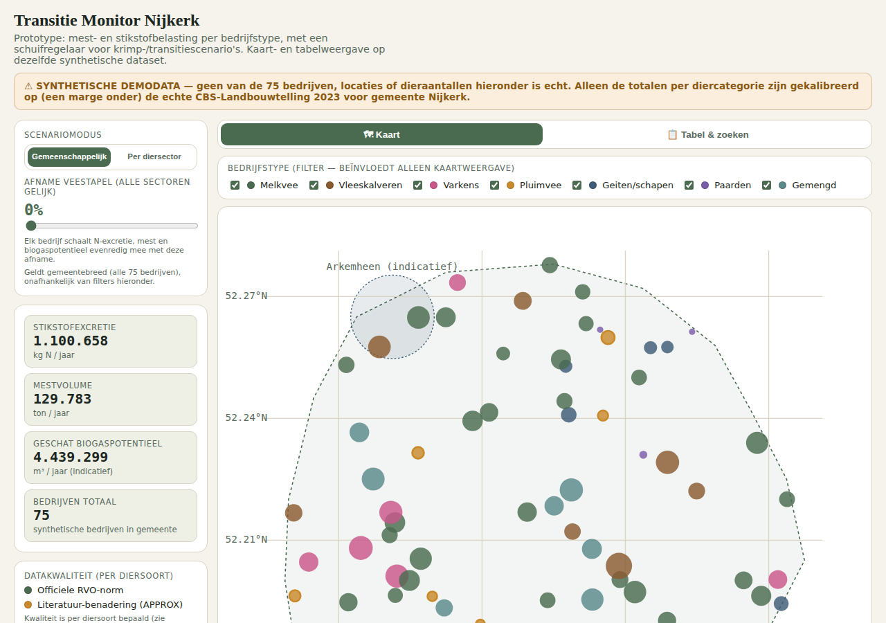
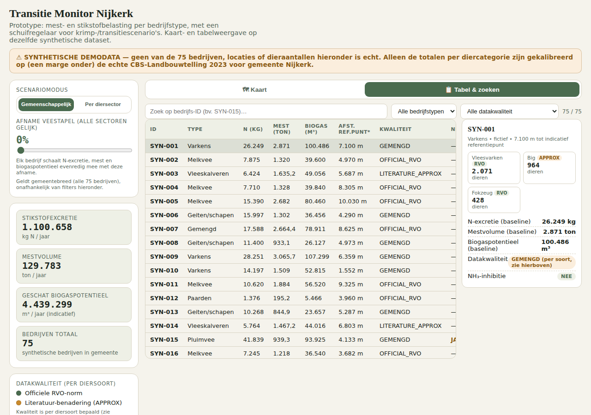

# Nijkerk Agricultural Transition Monitor

Two dashboards about agriculture and nitrogen in gemeente Nijkerk, in one repo.
They are kept strictly apart:

| | Page | Data |
|---|---|---|
| **Stikstofmonitor Nijkerk** | [`nitrogen.html`](nitrogen.html) | Real open government data only |
| **Transitie Monitor (prototype)** | [`index.html`](index.html) | Fully synthetic demo data |

Open either file in a browser. No server is needed. To get a shareable link,
enable GitHub Pages for this repo (Settings → Pages → Source: `main` / root).

---

## Stikstofmonitor Nijkerk: real open data

An independent data project by a resident of Nijkerk. It brings published
figures on livestock, nitrogen emissions, nitrogen deposition and nature in
and around Nijkerk together on one page, with the source, reference date and
limitations next to every figure. The page is in Dutch.

<p>
  
</p>
<p>
  
</p>

### What it shows

| Layer | Source | What is shown |
|---|---|---|
| Livestock and farms | CBS Landbouwtelling (StatLine 80781ned) | Counts 2000–2025, indexed against Gelderland, with method breaks marked |
| NH₃ and NOx emissions | Emissieregistratie, series 1990–2024 | Emissions in Nijkerk by sector |
| Nitrogen deposition | RIVM GDN maps, 2025 | 1×1 km map (total N, NHx, NOy) and the area-weighted mean for Nijkerk |
| Natura 2000 boundaries | RVO via PDOK | Areas in and around Nijkerk, distance and overlap |
| Nitrogen-sensitive habitat | RIVM AERIUS open data | Mapped habitat types with their critical deposition value (KDW) |

Figures on the page as of October 2026:

- Mean nitrogen deposition in Nijkerk, 2025: about 1,158 mol N/ha/year
  (uncertainty per grid cell 30–35%); about 70% of it is reduced nitrogen (NHx).
- 14% of the municipality is Natura 2000, almost all of it Arkemheen (a
  Birds Directive area).
- According to the AERIUS habitat map there is no nitrogen-sensitive habitat
  inside the municipality; the nearest lies about 0.7 km outside it, in the
  Veluwe.
- Emissions in Nijkerk, 2024: 352 t NH₃ (93% agriculture) and 317 t NOx
  (65% traffic and transport).

### What it deliberately does not do

- No own deposition modelling and no scenarios.
- No link drawn between animal numbers and deposition.
- No conversion from emissions to deposition.
- No own comparison of deposition with critical deposition values.
- No individual farms.
- No cost estimates.

Each source, what may and may not be calculated from it, and what is still
unverified is written down in [`docs/nitrogen-sources.md`](docs/nitrogen-sources.md).

### Rebuilding the data

```bash
pip install requests shapely pyproj openpyxl
```

Run from the repo root, in this order:

```bash
python scripts/nitrogen/fetch_cbs_livestock.py     # CBS livestock and farms
python scripts/nitrogen/fetch_natura2000.py        # municipal boundary + Natura 2000 (PDOK)
python scripts/nitrogen/fetch_rivm_deposition.py   # RIVM deposition grid
python scripts/nitrogen/fetch_aerius_habitats.py   # AERIUS nitrogen-sensitive habitat
python scripts/nitrogen/load_emissions.py          # Emissieregistratie (needs a manual export, see the script)
python scripts/nitrogen/build_page_data.py         # bundles everything for nitrogen.html
```

Downloads are kept in `data/nitrogen/raw/` (not committed). The processed
files that the page reads are in `data/nitrogen/processed/`.

### Knowing when a source changed

```bash
python scripts/nitrogen/check_sources.py
```

compares what the sources say now with the state saved in
`data/nitrogen/source_state.json` and prints a report. It changes nothing
on the page. A scheduled job runs the same check once a month and opens a
GitHub issue when there is something to look at; see
[`docs/source-check.md`](docs/source-check.md).

---

## Transitie Monitor (prototype): synthetic data

Interactive prototype: a manure/nitrogen/biogas-potential dashboard with a
scenario engine, built on a **fully synthetic** demo dataset of 75 fictional
farms.

<p>
  
  
</p>

### What this is

Grew out of an earlier feasibility analysis for a Nijkerk "Biogas Hub"
(manure-to-biogas co-digestion facility). That analysis showed the hub's
business case is fragile once SDE++ subsidy support is factored in and
feedstock volumes decline — so instead of pushing a shaky infrastructure
proposal, this repo builds something in the author's own skillset (data /
GIS / cloud engineering): a reusable **monitoring and scenario-planning
tool** for the municipality's agricultural transition, of which the biogas
question is just one input.

### What it does

- Map + searchable table of 75 synthetic farms (7 archetypes: melkvee,
  vleeskalveren, varkens, pluimvee, geiten/schapen, paarden, gemengd)
- A **species-level scenario engine**: drag a reduction slider per animal
  sector (melkvee / varkens / pluimvee / overig) and watch N-excretion,
  manure volume and estimated biogas potential recompute live, per animal
  category — not a flat per-farm percentage
- Data-quality labeling per animal category (official RVO norm vs.
  literature approximation), not a single blanket label per farm
- Ammonia-inhibition flag for poultry-heavy manure mixes

### Data & methodology — read before using this for anything real

**Every farm, location and animal count in this dataset is entirely
fictional.** Nothing here describes a real business, address or parcel.

- **Totals are calibrated, not the individual rows.** Per animal category,
  the *sum* across all 75 synthetic farms is set to ~85% of the real 2023
  CBS Landbouwtelling total for gemeente Nijkerk (`data/generation_summary.json`
  has the exact real-vs-synthetic comparison per category). No individual
  farm's numbers are real.
- **Locations are fully random**, generated inside a schematic (non-cadastral)
  Nijkerk outline, excluding the built-up town centre and enforcing a minimum
  150m spacing between farms. An earlier version anchored points to real BRP
  agricultural-parcel centroids + jitter; that was deliberately replaced
  after review because it was judged not privacy-safe enough for a municipal
  presentation. See `scripts/generate.py` for the current method.
- **N-excretion / manure coefficients** are per-animal-category norms, mostly
  from RVO.nl "Tabel 4 Diergebonden normen 2024" and "Tabel 6 Stikstof en
  fosfaat per melkkoe 2024"; a few categories (marked `LITERATURE_APPROX` in
  the data) are literature-typical estimates, not taken from an RVO table
  fetched for this project. See `scripts/constants.py`.
- **Biogas yield and manure density** per manure type are illustrative
  literature ranges, not independently verified for this project.
- **"Afstand ref.punt"** is the distance to a self-chosen, indicative point
  near Arkemheen — **not** the official Natura 2000 boundary polygon.

This is a demonstration prototype, not a policy instrument, and not a
replacement for the underlying emission-reduction report.

### Regenerating the synthetic data

If a coefficient in `scripts/constants.py` changes, run in order from
`scripts/`:

```bash
python3 generate.py            # rebuilds data/*.csv + generation_summary.json
python3 build_compact_json.py  # rebuilds data/farms_data.json
python3 sync_js_constants.py   # re-syncs index.html's embedded JS
python3 build_doc_xlsx.py      # rebuilds the documentation workbook
```

---

## Repo layout

```
nitrogen.html         Stikstofmonitor (real open data)
index.html            Transitie Monitor prototype (synthetic data)
data/
  nitrogen/processed/                the files nitrogen.html reads (committed)
  nitrogen/raw/                      downloads (not committed)
  nitrogen/source_state.json         fingerprints of the sources at the last check
  nijkerk_synthetic_farms_2023.csv   synthetic: full 75-row dataset
  farms_data.json                    synthetic: compact JSON embedded in index.html
  generation_summary.json            synthetic: real vs. synthetic totals per category
scripts/
  nitrogen/               one script per real data source, plus config.py,
                          build_page_data.py and check_sources.py
  constants.py            synthetic: single source of truth for all coefficients
  generate.py             synthetic: builds data/*.csv + generation_summary.json
  build_compact_json.py   synthetic: builds data/farms_data.json from the CSV
  sync_js_constants.py    synthetic: regenerates index.html's embedded JS constants
  build_doc_xlsx.py       synthetic: builds docs/*.xlsx methodology documentation
pipeline/                 ETL pipeline: CBS livestock counts into PostgreSQL
                          (separate from the page; see pipeline/README.md)
docker/
  source-check/Dockerfile image for the monthly source check
  etl-pipeline/Dockerfile image for the ETL pipeline
docs/
  nitrogen-sources.md     source register for the Stikstofmonitor
  methodology.md          the method of the Stikstofmonitor in two pages
  source-check.md         the monthly source check: how it runs, what to do
  nitrogen-technology-research.md   desk research: manure N treatment technologies (exploratory, prototype side)
  Nijkerk_Synthetische_Demodata_Documentatie.xlsx   synthetic: methodology + data-quality tables
```

## Roadmap

Done since the first version of this repo: real Natura 2000 boundaries from
PDOK, and official NH₃ and NOx emission figures in place of an own
emission-factor estimate.

Possible next steps:

1. Add the exceedance flags that AERIUS publishes per hexagon, once their
   definitions have been checked against the AERIUS documentation.
2. Compare the deposition in Nijkerk with the Gelderland average.
3. For the prototype: replace synthetic data with real (anonymized,
   validated) farm-level data, with the municipality's or RVO's cooperation.

## Sources and terms

CBS, RIVM (GDN maps and AERIUS), Emissieregistratie, and PDOK (RVO,
Kadaster). This project is not a publication of gemeente Nijkerk or of any
of these organisations.
